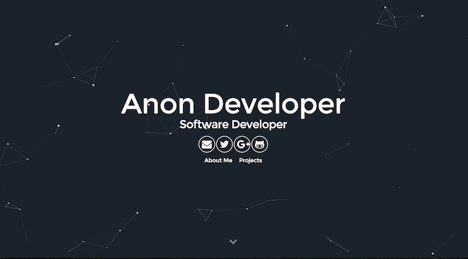

# Portafolio José R Guignan - Data Scientist

## Tema Particle Jekyll 

Este es un sencillo y minimalista plantilla para Jekyll diseñada para desarrolladores que desean mostrar su portafolio.

Características del Tema:

- Gulp
- SASS
- Sweet Scroll
- Particle.js
- BrowserSync
- Font Awesome and Devicon icons
- Google Analytics
- Info Customization

## Configuración Básica

1. [Install Jekyll](http://jekyllrb.com)
2. Clona el tema particle: `git clone https://github.com/nrandecker/particle.git`
3. Edita `_config.yml` para personalizar tu sitio.

## Licencia

Este tema es software gratuito y de código abierto, distribuido bajo la Licencia MIT. Así que siéntete libre de usar este tema de Jekyll como desees.

## Créditos

Este tema fue parcialmente diseñado con la inspiración de estas personas:
- [Willian Justen](https://github.com/willianjusten/will-jekyll-template)
- [Vincent Garreau](https://github.com/VincentGarreau/particles.js/)
